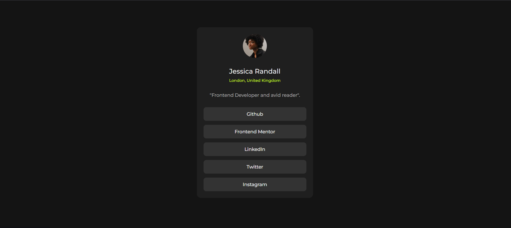

# Frontend Mentor - Social links profile solution

This is a solution to the [Social links profile challenge on Frontend Mentor](https://www.frontendmentor.io/challenges/social-links-profile-UG32l9m6dQ). Frontend Mentor challenges help you improve your coding skills by building realistic projects. 

## Table of contents

- [Overview](#overview)
  - [Screenshot](#screenshot)
  - [Links](#links)
- [Author](#author)

## Overview

### Screenshot

### Links

- Live Site URL: [https://tanoypaul.github.io/social-links](https://tanoypaul.github.io/social-links)

## My process

### Built with

- Semantic HTML5 markup
- CSS custom properties
- Flexbox

## Author

- Website - [Tanoy Paul](https://tanoypaul.github.io/devfolio)
- Frontend Mentor - [@Tanoy Paul](https://www.frontendmentor.io/profile/TanoyPaul)
- LinkedIn - [@Tanoy Paul](https://www.linkedin.com/in/tanoy-paul-aa720725b/)
